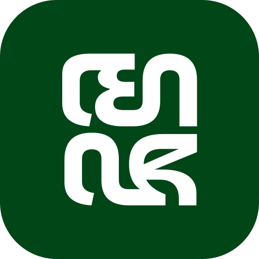

<p align="center">
  
</p>

# MojoInsight

Sistem informasi kependudukan untuk 6 RT di RW 13, Dusun Mojo, Desa
Ngeposari, Kecamatan Semanu, Gunung Kidul. Dibangun sebagai program kerja
individu KKN, menggantikan pencatatan manual (fotokopi Kartu Keluarga) yang
selama ini dipakai dengan dashboard admin dan visualisasi data publik yang
selalu sinkron dengan kondisi terkini.

**Live:** [mojoinsight.tech](https://www.mojoinsight.tech/)

Cakupan data saat ini: 279 keluarga, sekitar 800 jiwa, 6 RT.

## Tech Stack


Satu aplikasi Next.js (App Router). Data disimpan di Supabase (PostgreSQL).
Halaman publik hanya membaca view agregat, sedangkan panel admin menulis
lewat Server Actions ke tabel yang dijaga Row Level Security. Halaman
publik tidak pernah menyentuh tabel mentah secara langsung, jadi nama dan
tanggal lahir warga tidak pernah terekspos di sisi publik.

## Fitur

- Landing publik dengan live counter (total KK, total jiwa, kelahiran dan
  kematian tahun berjalan), grafik distribusi kelompok usia (donut) dan
  Top 3 Pekerjaan (bar), serta peta 6 RT (Leaflet dengan tile OSM,
  koordinat GPS asli) lengkap dengan panel detail per RT.
- Halaman Struktur Pengurus (`/struktur`): kartu Kepala Dukuh dan Ketua
  RW, grid Ketua RT 01-06, foto dari Supabase Storage dengan fallback
  avatar inisial. Urutan tampil otomatis mengikuti hierarki jabatan.
- Tabel Data KK di admin: pencarian nama/No. KK, filter per RT, paginasi,
  dan ekspor ke `.xlsx` mengikuti filter yang sedang aktif.
- Modal Form KK berbentuk nested: No. KK dan RT diisi sekali, lalu
  anggota keluarga bisa ditambah/dihapus berkali-kali sebelum submit.
  Dropdown Pekerjaan pakai search/autocomplete, dan ada peringatan
  duplikat nama plus tanggal lahir yang muncul langsung saat mengetik
  (lintas RT, sifatnya non-blocking).
- Log Mutasi: pencatatan append-only untuk kejadian Lahir, Meninggal,
  Pindah Masuk, dan Pindah Keluar. Status kependudukan anggota ikut
  ter-update otomatis lewat trigger, dan counter kelahiran/kematian di
  hero dihitung dari log ini.
- CRUD Struktur Pengurus untuk mengelola profil pengurus beserta upload
  dan hapus foto.
- Auth admin pakai Supabase Auth (email/password; Google OAuth sudah
  disiapkan di kode, tinggal aktifkan provider-nya), whitelist email
  lewat tabel `admin_users`, middleware yang melindungi `/admin/*`, dan
  halaman untuk ganti kata sandi sendiri.
- Dua tingkat peran: `super_admin` (akses semua RT) dan `rt_admin` (CRUD
  penuh tapi terkunci ke RT-nya sendiri). Ditegakkan lewat RLS, bukan
  sekadar filter di UI, jadi tidak bisa dilewati lewat panggilan API
  langsung.
- Sinkronisasi otomatis lewat `revalidatePath` setelah tiap mutasi admin,
  jadi halaman publik langsung ikut terbarui tanpa perlu deploy ulang.

## Struktur Proyek

```
mojoinsight/
├── app/
│   ├── page.tsx                 landing: hero + demografi + peta
│   ├── struktur/                halaman Struktur Pengurus (publik)
│   ├── admin/
│   │   ├── login/               gerbang auth (di luar shell admin)
│   │   └── (protected)/         panel admin (dijaga middleware + RLS)
│   │       ├── page.tsx         tabel & ekspor Data KK
│   │       ├── mutasi/          Log Mutasi
│   │       ├── struktur/        CRUD Struktur Pengurus
│   │       └── settings/        ganti kata sandi
│   └── auth/callback/           callback OAuth
├── components/                  hero, chart (Recharts), peta (Leaflet), shell admin
├── lib/
│   ├── supabase/                client browser / server / middleware
│   └── *-list.ts                master data dropdown (pekerjaan, hubungan, jabatan, mutasi)
├── supabase/migrations/         schema, RLS, view agregat, storage bucket
└── next.config.ts
```

## Menjalankan Secara Lokal

### 1. Environment variable

```bash
cp .env.example .env.local
```

Isi dari Supabase dashboard, menu Project Settings > API:

| Variable | Keterangan |
| --- | --- |
| `NEXT_PUBLIC_SUPABASE_URL` | URL project Supabase |
| `NEXT_PUBLIC_SUPABASE_ANON_KEY` | anon/publishable key, aman dipakai di browser |
| `SUPABASE_SERVICE_ROLE_KEY` | server-only, bypass RLS, dipakai skrip migrasi data saja, jangan pernah ikut ter-bundle ke browser |

### 2. Dependency & dev server

```bash
npm install
npm run dev          # http://localhost:3000
```

### 3. Database

Migrasi ada di `supabase/migrations/`. Terapkan ke project Supabase lewat
CLI:

```bash
supabase link --project-ref <project-ref>
supabase db push
```

## Batas Kelompok Usia

| Kelompok | Rentang |
| --- | --- |
| Usia Belajar | 0-14 |
| Usia Produktif | 15-59 |
| Lansia | 60+ |

Mengikuti UU No. 13 Tahun 1998, bukan cutoff 65 tahun ala BPS, supaya
selaras dengan program riil di lapangan seperti Posyandu Lansia.

## Tim

Program kerja individu KKN Tania di Dusun Mojo.

| Orang | Bagian |
| --- | --- |
| Tania | Pemilik program, data entry, setup infrastruktur (Supabase & Vercel), pengembangan fitur |
| Hidayat | Bantu coding/development |
